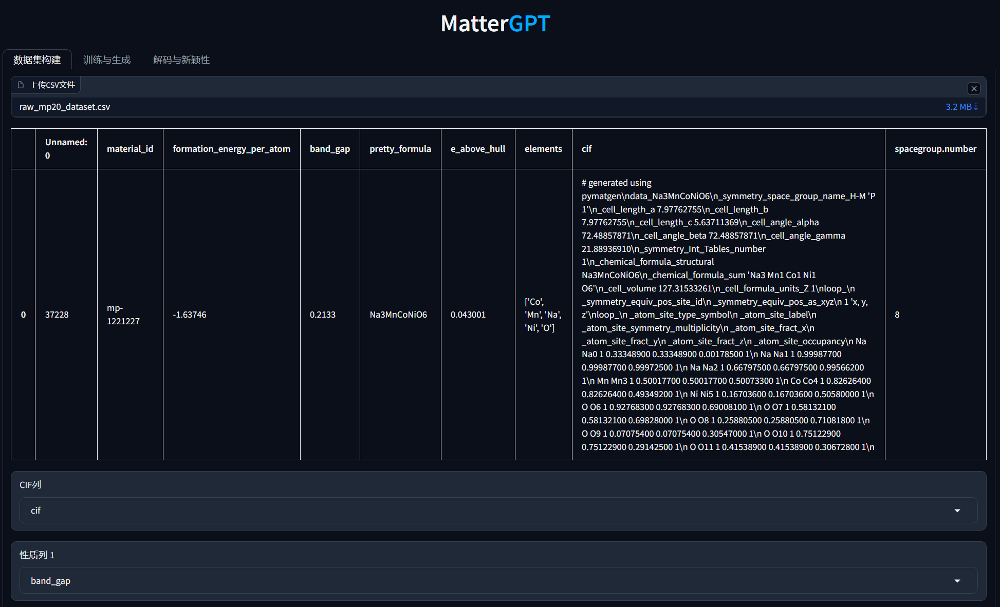

# Simplified Line-Input Crystal-Encoding System (SLICES)

The **Simplified Line-Input Crystal-Encoding System (SLICES)** is the first invertible and invariant crystal representation tool. This software supports encoding and decoding crystal structures, reconstructing them, and generating new materials with desired properties using generative deep learning.

**Related Publications and Resources:**
- **Nature Communications**: [Paper](https://www.nature.com/articles/s41467-023-42870-7)
- **MatterGPT 图形界面介绍**: [Bilibili](https://www.bilibili.com/video/BV15XrmYMEYU/)
- **SLICES 晶体语言介绍**: [Bilibili](https://www.bilibili.com/video/BV17H4y1W7aZ/)
- **SLICES 101**: [Bilibili](https://www.bilibili.com/video/BV1Yr42147dM/)
- **Data and Results**: [Figshare](https://doi.org/10.6084/m9.figshare.22707472)
- **MatterGPT Paper**: [arXiv](https://arxiv.org/abs/2408.07608)
- **MatterGPT Demo**: [Huggingface](https://huggingface.co/spaces/xiaohang07/MatterGPT_CPU)
- **SLICES-PLUS Paper**: [arXiv](https://arxiv.org/abs/2410.22828)
---

## Main Functionalities

1. **Encode crystal structures into SLICES strings**
2. **Reconstruct original crystal structures (Text2Crystal)**
3. **Inverse design of solid-state materials with desired properties using MatterGPT**
4. **Inverse design of solid-state materials with desired properties and crystal systems using MatterGPT ([SLICES-PLUS](https://arxiv.org/abs/2410.22828))**

---
We provide a huggingface space to allow one-click conversion of CIF to SLICES and SLICES to CIF online. 
### [[Online SLICES/CIF Convertor]](https://huggingface.co/spaces/xiaohang07/SLICES)
[](https://huggingface.co/spaces/xiaohang07/SLICES "Online SLICES/CIF Convertor - Click to Try!")
### [[MatterGPT Online Demo]](https://huggingface.co/spaces/xiaohang07/MatterGPT_CPU)
[](https://huggingface.co/spaces/xiaohang07/MatterGPT_CPU "MatterGPT Online Demo - Click to Try!")
### MatterGPT 图形界面 

---

## Table of Contents

1. [Installation](#installation)
   - [Local Installation](#local-installation)
   - [Docker Installation](#docker-installation)
2. [Examples](#examples)
   - [Crystal to SLICES and SLICES to Crystal](#crystal-to-slices-and-slices-to-crystal)
   - [Augment SLICES and Canonicalize SLICES](#augment-slices-and-canonicalize-slices)
3. [Tutorials](#tutorials)
    - **MatterGPT图形界面**: [Bilibili](https://www.bilibili.com/video/BV15XrmYMEYU/)
    - [MatterGPT脚本教程](./MatterGPT/tutorials_CN.sh)

    - **SLICES Video Tutorials**: [Bilibili](https://space.bilibili.com/398676911/channel/seriesdetail?sid=4012344)(#tutorials-for-docker-installation)
4. [Documentation](#documentation)
5. [Reproducing Benchmarks](#reproducing-benchmarks)
6. [Citation](#citation)
7. [Acknowledgements](#acknowledgement)
8. [Contact and Support](#contact-and-support)

---

## Installation
可以选择 1.本地安装 **或者** 2.docker安装。
## Local Installation
本地安装指南(Ubuntu或者win11的Ubuntu子系统)
### 1.1 安装 Miniconda 并配置中国源 
**如果你已经安装了 Miniconda 并配置好了中国镜像源，可以跳过这一步。**
- 首先，更新 Ubuntu 系统的包索引并安装 `wget` 工具，用于下载文件。
- 然后，你通过 `wget` 下载 Miniconda 安装脚本并执行安装，将 Miniconda 安装到 `~/miniconda3` 目录。
- 在安装完成后，删除安装脚本，并配置了 `pip` 使用清华大学的镜像源，以提高下载速度。

```bash
sudo apt-get update
sudo apt-get install wget
mkdir -p ~/miniconda3
wget https://repo.anaconda.com/miniconda/Miniconda3-latest-Linux-x86_64.sh -O ~/miniconda3/miniconda.sh
bash ~/miniconda3/miniconda.sh -b -u -p ~/miniconda3
rm ~/miniconda3/miniconda.sh
source ~/miniconda3/bin/activate
conda init --all
conda config --add channels https://mirrors.tuna.tsinghua.edu.cn/anaconda/pkgs/main/
conda config --add channels https://mirrors.tuna.tsinghua.edu.cn/anaconda/pkgs/free/
conda config --set show_channel_urls yes
pip config set global.index-url https://mirrors.tuna.tsinghua.edu.cn/pypi/web/simple
python -m pip install --upgrade pip
```

### 1.2 下载 SLICES 仓库并安装 Conda 子环境及 SLICES 包
- 下载 SLICES 项目的 GitHub 文件夹，并将其解压。
- 进入解压后的目录，使用 `conda` 创建一个新环境，并安装所需的依赖（环境配置文件是 `environments.yml`）。
- 然后，激活 `slices` 环境，并使用 `pip install slices` 安装 SLICES 包。

```bash
wget https://github.com/xiaohang007/SLICES/archive/refs/heads/main.zip -O slices_repo.zip
unzip slices_repo.zip
cd SLICES-main
conda env create --name slices --file=environments.yml
conda activate slices
pip install gradio==4.44.1 slices
```
安装完成！
### 1.3 访问图形界面  注意访问图形界面必须安装slices>=2.0.7
```bash
cd MatterGPT
python app.py
```
按住 `CTRL` (或 Mac 上的 `Command`)，然后点击terminal中的 `http://localhost:7860`链接来打开MatterGPT的图形界面。


如果想用Docker来跑SLICES的环境，可以选择下面的安装方法：
### Docker Installation

请按照以下步骤使用 Docker 安装 SLICES:

---

1. **下载仓库**，并解压文件。

2. **在 `slurm.conf`中配置 CPU 线程数量。**

3. **执行 Docker 集成命令：**

```bash
# 从 Docker Hub 下载已经构建的 SLICES Docker 镜像

docker pull xiaohang07/slices:v10

# 如果 docker pull 不管用，您可以在 https://figshare.com/s/260701a1accd0192de20 下载压缩的 docker 镜像 v10。

# 然后，使用以下命令4线程并行解压缩以及加载此 docker 镜像：
xz -T4 -dc dockerv10.tar.xz | docker load

# 您也可以使用此仓库中的 Dockerfile 构建自己的 docker 镜像。感谢 Haidi Wang 教授 (https://haidi-ustc.github.io/about/) 提供的 Dockerfile。

# 使脚本具有执行权限
sudo chmod +x entrypoint_set_cpus_gradio.sh entrypoint_set_cpus.sh ./slices/xtb_noring_nooutput_nostdout_noCN

# 运行 Docker (将 [] 替换为您的绝对路径)
docker run -it -p 7860:7860 -h workq --shm-size=0.5gb --gpus all -v /[]:/crystal xiaohang07/slices:v10 /crystal/entrypoint_set_cpus_gradio.sh
```

5. **访问图形界面**:

   - 按住 `CTRL` (或 Mac 上的 `Command`)，然后点击terminal中的 `http://localhost:7860`链接来打开MatterGPT的图形界面。

---

### 注意
- **Windows 11**：使用完全支持 GPU 的 Docker 环境。

- **Ubuntu**：使用本地安装更好，因为 nvidia-docker 比较难安装。


---

## Examples

### Crystal to SLICES and SLICES to Crystal
Convert a crystal structure to its SLICES string and reconstruct it.

```python
from slices.core import SLICES
from pymatgen.core.structure import Structure

# Load crystal structure from file
original_structure = Structure.from_file(filename='NdSiRu.cif')
backend = SLICES()

# Convert to SLICES string
slices_NdSiRu = backend.structure2SLICES(original_structure)

# Reconstruct crystal and get predicted energy
reconstructed_structure, final_energy_per_atom = backend.SLICES2structure(slices_NdSiRu)

print('SLICES string of NdSiRu is:', slices_NdSiRu)
print('Reconstructed structure:', reconstructed_structure)
print('Final energy per atom:', final_energy_per_atom, 'eV/atom')
```

### Augment SLICES and Canonicalize SLICES
Generate augmented SLICES strings and reduce them to a canonical form.

```python
from slices.core import SLICES
from pymatgen.core.structure import Structure

# Load crystal structure
original_structure = Structure.from_file(filename='Sr3Ru2O7.cif')
backend = SLICES(graph_method='econnn')

# Generate augmented SLICES
slices_list = backend.structure2SLICESAug_atom_order(structure=original_structure, num=50)
canonical_slices = list(set(backend.get_canonical_SLICES(s) for s in slices_list))

print('Unique Canonical SLICES:', len(canonical_slices))
```
---

## Documentation
The official documentation is available at [Read the Docs](https://xiaohang007.github.io/SLICES/).

---

## Reproducing Benchmarks
Refer to the [Benchmarks Guide](benchmark/benchmarks.md) for detailed instructions.

---

## Citation

If you use SLICES, MatterGPT or SLICES-PLUS, please cite the following works:

```bibtex
@article{xiao2023invertible,
  title={An invertible, invariant crystal representation for inverse design of solid-state materials using generative deep learning},
  author={Xiao, Hang and Li, Rong and Shi, Xiaoyang and Chen, Yan and Zhu, Liangliang and Chen, Xi and Wang, Lei},
  journal={Nature Communications},
  volume={14},
  number={1},
  pages={7027},
  year={2023},
  publisher={Nature Publishing Group UK London}
}

@misc{chen2024mattergptgenerativetransformermultiproperty,
  title={MatterGPT: A Generative Transformer for Multi-Property Inverse Design of Solid-State Materials},
  author={Yan Chen and Xueru Wang and Xiaobin Deng and Yilun Liu and Xi Chen and Yunwei Zhang and Lei Wang and Hang Xiao},
  year={2024},
  eprint={2408.07608},
  archivePrefix={arXiv},
  primaryClass={cond-mat.mtrl-sci},
  url={https://arxiv.org/abs/2408.07608}
}

@misc{wang2024slicespluscrystalrepresentationleveraging,
      title={SLICES-PLUS: A Crystal Representation Leveraging Spatial Symmetry}, 
      author={Baoning Wang and Zhiyuan Xu and Zhiyu Han and Qiwen Nie and Hang Xiao and Gang Yan},
      year={2024},
      eprint={2410.22828},
      archivePrefix={arXiv},
      primaryClass={physics.comp-ph},
      url={https://arxiv.org/abs/2410.22828}, 
}
```

---

## Acknowledgement
Special thanks to the open-source projects and developers that inspired this work:
- [tobascco](https://github.com/peteboyd/tobascco)
- [xtb](https://github.com/grimme-lab/xtb)
- [m3gnet](https://github.com/materialsvirtuallab/m3gnet)
- [chgnet](https://github.com/CederGroupHub/chgnet)
- [molgpt](https://github.com/devalab/molgpt)

---

## Contact and Support
- **Email**: [hangxiao@ln.edu.hk](mailto:hangxiao@ln.edu.hk)
- **ResearchGate**: [Hang Xiao](https://www.researchgate.net/profile/Hang-Xiao-8)
- **Start a Discussion**: [GitHub Discussions](https://github.com/xiaohang007/SLICES/discussions/categories/general)

