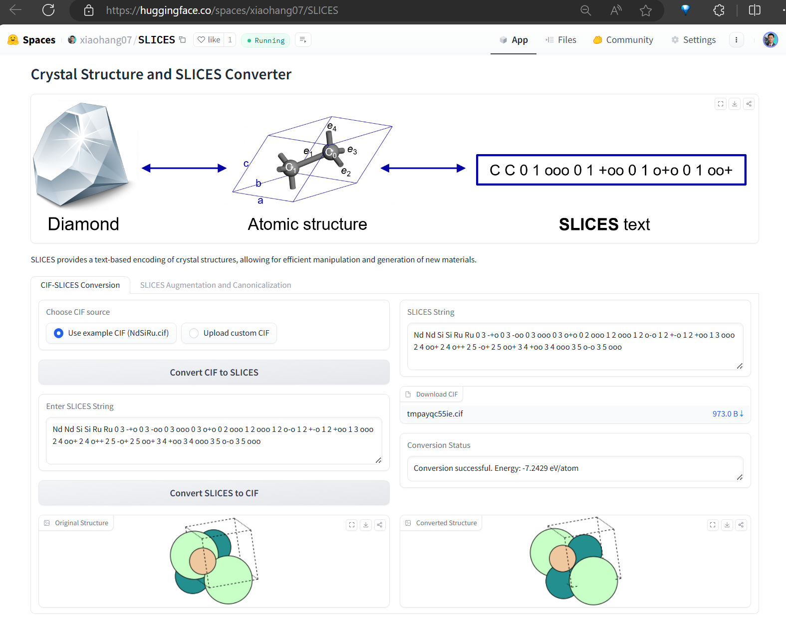
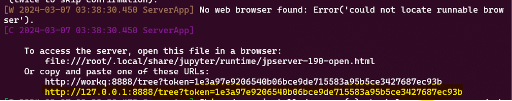

# Simplified Line-Input Crystal-Encoding System

This software implementes Simplified Line-Input Crystal-Encoding System (SLICES), the first invertible and invariant crystal representation.

It has several main functionalities:
- Encode crystal structures into SLICES strings
- **Reconstruct original crystal structures from their SLICES strings (Text2Crystal)**
- Generate crystals with desired properties using conditional RNN (Inverse Design)

Developed by Hang Xiao 2023.04 xiaohang07@live.cn

**Nature Communications** [[Paper]](https://www.nature.com/articles/s41467-023-42870-7) [[SLICES晶体语言视频介绍]](https://www.bilibili.com/video/BV17H4y1W7aZ/)[[SLICES101]](https://www.bilibili.com/video/BV1Yr42147dM/) [[Data/Results]](https://doi.org/10.6084/m9.figshare.22707472)[[Source code]](invcryrep/) 

We provide a huggingface space to allow one-click conversion of CIF to SLICES and SLICES to CIF online. 
## [[Online SLICES/CIF Convertor]](https://huggingface.co/spaces/xiaohang07/SLICES)
[](https://huggingface.co/spaces/xiaohang07/SLICES "Online SLICES/CIF Convertor - Click to Try!")
# MatterGPT  
## [[Paper]](https://arxiv.org/abs/2408.07608) [[MatterGPT Online Demo]](https://huggingface.co/spaces/xiaohang07/MatterGPT_CPU) [[视频简介]](https://www.bilibili.com/video/BV1HdeHeyEfP)[[视频教程]](https://www.bilibili.com/video/BV1agsLeUEAB)
[](https://huggingface.co/spaces/xiaohang07/MatterGPT_CPU "MatterGPT Online Demo - Click to Try!")

## Table of Contents

- [Installation](#installation)
- [Examples](#examples)
  - [Crystal to SLICES and SLICES to crystal](#crystal-to-slices-and-slices-to-crystal)
  - [Augment SLICES and canonicalize SLICES](#augment-slices-and-canonicalize-slices)
- [SLICES视频教程](https://space.bilibili.com/398676911/channel/seriesdetail?sid=4012344)
- [MatterGPT视频教程](https://www.bilibili.com/video/BV1agsLeUEAB)
- [Tutorials](#tutorials)
  - [Video Tutorials](https://space.bilibili.com/398676911/channel/seriesdetail?sid=4037964)
  - [Jupyter backend setup](#jupyter-backend-setup)
  - [Tutorial 1.0 Examples](./Tutorial_1.0_Intro_Example.ipynb)
  - [Tutorial 2.1 MatterGPT for Single-Property (eform) Material Inverse Design](./Tutorial_2.1_MatterGPT_eform.ipynb)
  - [Tutorial 2.2 MatterGPT for Single-Property (bandgap) Material Inverse Design](./Tutorial_2.2_MatterGPT_bandgap.ipynb)
  - [Tutorial 2.3 MatterGPT for Multi-Property (bandgap&eform) Material Inverse Design](./Tutorial_2.3_MatterGPT_2props_bandgap_eform.ipynb)
- [Documentation](#documentation)
- [Reproduction of benchmarks](#reproduction-of-benchmarks)
- [Citation](#citation)
- [Contact](#contact)

## Installation
```bash
# pip config set global.index-url https://pypi.tuna.tsinghua.edu.cn/simple (use this if you are in China)
conda env create --name slices --file=environments.yml
conda activate slices
pip install slices==2.0.2
#If you're in China, use this command instead: "pip install slices -i https://pypi.tuna.tsinghua.edu.cn/simple".
```
Please note that this installtion method is intended for Linux operating systems like Ubuntu and CentOS. Unfortunately, SLICES is not directly compatible with Windows or MacOS due to the modified XTB binary was compiled on Linux. To run SLICES on Windows or MacOS, one can run SLICES with docker, referring to [Jupyter backend setup](#jupyter-backend-setup).

If "TypeError: bases must be types" occurs when you use SLICES library, then do this:
```bash
pip install protobuf==3.20.0
```
If errors still occur, then you can run SLICES with docker, referring to [Jupyter backend setup](#jupyter-backend-setup).
## Examples
### Crystal to SLICES and SLICES to crystal
Converting a crystal structure to its SLICES string and converting this SLICES string back to its original crystal structure. 
Suppose we wish to convert the crystal structure of NdSiRu (mp-5239,https://next-gen.materialsproject.org/materials/mp-5239?material_ids=mp-5239) to its SLICES string and converting this SLICES string back to its original crystal structure. The python code below accomplishes this:
```python
from slices.core import SLICES
from pymatgen.core.structure import Structure
# obtaining the pymatgen Structure instance of NdSiRu
original_structure = Structure.from_file(filename='NdSiRu.cif')
# creating an instance of the InvCryRep Class (initialization)
backend=SLICES()
# converting a crystal structure to its SLICES string
slices_NdSiRu=backend.structure2SLICES(original_structure) 
# converting a SLICES string back to its original crystal structure and obtaining its M3GNet_IAP-predicted energy_per_atom
reconstructed_structure,final_energy_per_atom_IAP = backend.SLICES2structure(slices_NdSiRu)
print('SLICES string of NdSiRu is: ',slices_NdSiRu)
print('\nReconstructed_structure is: ',reconstructed_structure)
print('\nfinal_energy_per_atom_IAP is: ',final_energy_per_atom_IAP,' eV/atom')
# if final_energy_per_atom_IAP is 0, it means the M3GNet_IAP refinement failed, and the reconstructed_structure is the ZL*-optimized structure.
```
### Augment SLICES and canonicalize SLICES
Converting a crystal structure to its SLICES string and perform data augmentation (50x), then reduce these 50 SLICES to 1 canonical SLICES with get_canonical_SLICES.
```python
from slices.core import SLICES
from pymatgen.core.structure import Structure
from pymatgen.analysis.structure_matcher import StructureMatcher, ElementComparator
# obtaining the pymatgen Structure instance of Sr3Ru2O7
original_structure = Structure.from_file(filename='Sr3Ru2O7.cif')
# creating an instance of the InvCryRep Class (initialization)
backend=SLICES(graph_method='econnn')
# converting a crystal structure to its SLICES string and perform data augmentation (50x)
slices_list=backend.structure2SLICESAug_atom_order(structure=original_structure,num=50) 
slices_list_unique=list(set(slices_list))
cannon_slices_list=[]
for i in slices_list_unique:
    cannon_slices_list.append(backend.get_canonical_SLICES(i))
# test get_canonical_SLICES
print(len(slices_list),len(set(cannon_slices_list)))
# 50 SLICES generated by data augmentation has been reduced to 1 canonical SLICES
```
## [SLICES视频教程](https://space.bilibili.com/398676911/channel/seriesdetail?sid=4012344)
## [MatterGPT视频教程](https://www.bilibili.com/video/BV1agsLeUEAB)
## Tutorials
### [Video Tutorials](https://space.bilibili.com/398676911/channel/seriesdetail?sid=4037964)
### Jupyter backend setup
**(1) Download this repo and unzipped it.**

**(2) Put Materials Project's new API key in "APIKEY.ini".** 

**(3) Edit "CPUs" in "slurm.conf" to set up the number of CPU threads available for the docker container.**

**(4) Run following commands in terminal (Linux or WSL2 Ubuntu on Win11)** 
```bash
# Download SLICES_docker with pre-installed SLICES and other relevant packages. 
docker pull xiaohang07/slices:v9  
# you can build your own docker image using the Dockerfile in this repo. Many thanks to Prof. Haidi Wang (https://haidi-ustc.github.io/about/) for the Dockerfile.
# You can download the compressed docker image v9 at https://figshare.com/s/260701a1accd0192de20 if docker pull does not work. 
# Then you can load this docker image using the following command: 
xz -dc slices_v9.tar.xz | docker load
# Make entrypoint_set_cpus.sh executable 
sudo chmod +x entrypoint_set_cpus_jupyter.sh ./slices/xtb_noring_nooutput_nostdout_noCN
# Repalce "[]" with the absolute path of this repo's unzipped folder to setup share folder for the docker container.
# e.g. for windows cmd: -v C:\Users\admin\Desktop\SLICES:/crystal
# e.g. for windows wsl: -v /mnt/c/Users/admin/Desktop/SLICES:/crystal
# e.g. for linux: -v /home/admin/Desktop/SLICES:/crystal
docker run -it -p 8888:8888 -h workq  --shm-size=0.5gb --gpus all -v /[]:/crystal xiaohang07/slices:v9 /crystal/entrypoint_set_cpus_jupyter.sh
```
**(5) Press CTRL (or Command on Mac) and click the link that starts with http://127.0.0.1 in your terminal (highlighted in yellow in the image below).
This will open the Jupyter notebook in your web browser. Click on the Tutorial_*.ipynb file to load the relevant tutorial notebook.**

### [Tutorial 1.0 Examples](./Tutorial_1.0_Intro_Example.ipynb)
### [Tutorial 2.1 MatterGPT for Single-Property (eform) Material Inverse Design](./Tutorial_2.1_MatterGPT_eform.ipynb)
### [Tutorial 2.2 MatterGPT for Single-Property (bandgap) Material Inverse Design](./Tutorial_2.2_MatterGPT_bandgap.ipynb)
### [Tutorial 2.3 MatterGPT for Multi-Property (bandgap&eform) Material Inverse Design](./Tutorial_2.3_MatterGPT_2props_bandgap_eform.ipynb)


## Documentation
The `SLICES` documentation is hosted at [read-the-docs](https://xiaohang007.github.io/SLICES/).

## Reproduction of benchmarks
For detailed instructions on reproducing benchmarks, please refer to the [benchmarks documentation](benchmark/benchmarks.md).


## Citation

Please consider citing the following paper if you find our code & data useful.

```
@article{xiao2023invertible,
  title={An invertible, invariant crystal representation for inverse design of solid-state materials using generative deep learning},
  author={Xiao, Hang and Li, Rong and Shi, Xiaoyang and Chen, Yan and Zhu, Liangliang and Chen, Xi and Wang, Lei},
  journal={Nature Communications},
  volume={14},
  number={1},
  pages={7027},
  year={2023},
  publisher={Nature Publishing Group UK London}
}
```

```
@misc{chen2024mattergptgenerativetransformermultiproperty,
      title={MatterGPT: A Generative Transformer for Multi-Property Inverse Design of Solid-State Materials}, 
      author={Yan Chen and Xueru Wang and Xiaobin Deng and Yilun Liu and Xi Chen and Yunwei Zhang and Lei Wang and Hang Xiao},
      year={2024},
      eprint={2408.07608},
      archivePrefix={arXiv},
      primaryClass={cond-mat.mtrl-sci},
      url={https://arxiv.org/abs/2408.07608}, 
}
```
## Acknowledgement
During the development process, I referenced and drew inspiration from several excellent open source projects and related resources. I would like to express special thanks to the developers of these projects and the contributions of the open source community. The main projects we referenced are:
 - [tobascco](https://github.com/peteboyd/tobascco)
 - [xtb](https://github.com/grimme-lab/xtb)
 - [m3gnet](https://github.com/materialsvirtuallab/m3gnet)
 - [chgnet](https://github.com/CederGroupHub/chgnet)
 - [molgpt](https://github.com/devalab/molgpt)
 
## Contact and Support
Start a new discussion thread in [[Discussion]](https://github.com/xiaohang007/SLICES/discussions/categories/general), or reach out to Hang Xiao (https://www.researchgate.net/profile/Hang-Xiao-8) xiaohang07@live.cn if you have any questions.

