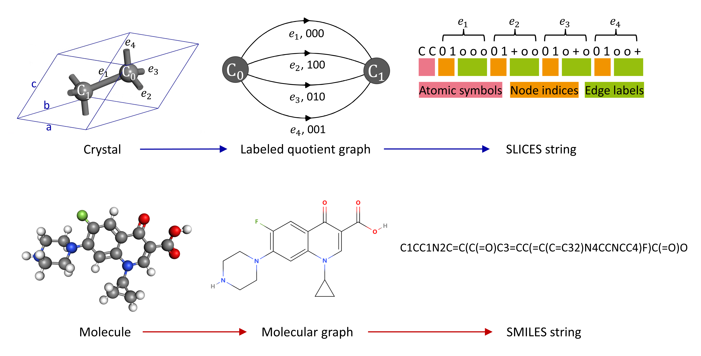

# Simplified Line-Input Crystal-Encoding System

This software implementes Simplified Line-Input Crystal-Encoding System (SLICES), the first invertible and invariant crystal representation.

It has several main functionalities:
- Encode crystal structures into SLICES strings
- **Reconstruct original crystal structures from their SLICES strings (Text2Crystal)**
- Generate crystals with desired properties using conditional RNN (Inverse Design)

Developed by Hang Xiao 2023.04 xiaohang07@live.cn

[[Paper]](https://chemrxiv.org/engage/chemrxiv/article-details/64697e40a32ceeff2df995c0) [[Data/Results]](https://doi.org/10.6084/m9.figshare.22707472)
[[Source code]](invcryrep/) 

We also provide a codeocean capsule (a modular container for the software environment along with code and data, that runs in a browser), allowing one-click access to guaranteed computational reproducibility of SLICES's benchmark. [[Codeocean Capsule]](https://codeocean.com/capsule/8643173/tree/v1)


## Table of Contents

- [Installation](#installation)
- [Examples](#examples)
  - [Crystal to SLICES and SLICES to crystal](#crystal-to-slices-and-slices-to-crystal)
  - [Augment SLICES and canonicalize SLICES](#augment-slices-and-canonicalize-slices)
- [Documentation](#documentation)
- [Reproduction of benchmarks and inverse design case study](#reproduction-of-benchmarks-and-inverse-design-case-study)
  - [General setup](#general-setup)
  - [Reconstruction benchmark for MP-20](#reconstruction-benchmark-for-MP-20)
  - [Reconstruction benchmark for MP-21-40](#reconstruction-benchmark-for-MP-21-40)
  - [Reconstruction benchmark for QMOF-21-40](#reconstruction-benchmark-for-QMOF-21-40)
  - [Inverse design case study](#inverse-design-case-study)
  - [Material generation benchmark](#material-generation-benchmark)
  - [Property optimization benchmark](#property-optimization-benchmark)   
- [Citation](#citation)
- [Contact](#contact)

## Installation
```bash
pip install slices
#If you're in China and want to speed up the download, you can use this command instead: "pip install slices -i https://pypi.tuna.tsinghua.edu.cn/simple".
```
Please note that this installtion method is intended for Linux operating systems like Ubuntu and CentOS. Unfortunately, SLICES is not compatible with Windows due to the modified XTB binary was compiled on Linux. 

## Examples
### Crystal to SLICES and SLICES to crystal
Converting a crystal structure to its SLICES string and converting this SLICES string back to its original crystal structure. 
Suppose we wish to convert the crystal structure of NdSiRu (mp-5239,https://next-gen.materialsproject.org/materials/mp-5239?material_ids=mp-5239) to its SLICES string and converting this SLICES string back to its original crystal structure. The python code below accomplishes this:
```python
import os
from invcryrep.invcryrep import InvCryRep
from pymatgen.core.structure import Structure
# obtaining the pymatgen Structure instance of NdSiRu
original_structure = Structure.from_file(filename='NdSiRu.cif')
# creating an instance of the InvCryRep Class (initialization)
backend=InvCryRep()
# converting a crystal structure to its SLICES string
slices_NdSiRu=backend.structure2SLICES(original_structure) 
# converting a SLICES string back to its original crystal structure and obtaining its M3GNet_IAP-predicted energy_per_atom
reconstructed_structure,final_energy_per_atom_IAP = backend.SLICES2structure(slices_NdSiRu)
print('SLICES string of NdSiRu is: ',slices_NdSiRu)
print('\nReconstructed_structure is: ',reconstructed_structure)
print('\nfinal_energy_per_atom_IAP is: ',final_energy_per_atom_IAP,' eV/atom')
# if final_energy_per_atom_IAP is 0, it means the M3GNet_IAP refinement failed, and the reconstructed_structure is the ZL*-optimized structure.
```
### Augment SLICES and canonicalize SLICES
Converting a crystal structure to its SLICES string and perform data augmentation (2000x), then reduce these 2000 SLICES to 1 canonical SLICES with get_canonical_SLICES.
```python
import os
from invcryrep.invcryrep import InvCryRep
from pymatgen.core.structure import Structure
from pymatgen.analysis.structure_matcher import StructureMatcher, ElementComparator
# obtaining the pymatgen Structure instance of Sr3Ru2O7
original_structure = Structure.from_file(filename='Sr3Ru2O7.cif')
# creating an instance of the InvCryRep Class (initialization)
backend=InvCryRep(graph_method='econnn')
# converting a crystal structure to its SLICES string and perform data augmentation (2000x)
slices_list=backend.structure2SLICESAug(structure=original_structure,num=2000) 
slices_list_unique=list(set(slices_list))
cannon_slices_list=[]
for i in slices_list_unique:
    cannon_slices_list.append(backend.get_canonical_SLICES(i))
# test get_canonical_SLICES
print(len(slices_list),len(set(cannon_slices_list)))
# 2000 SLICES generated by data augmentation has been reduced to 1 canonical SLICES
```

## Documentation
The `SLICES` documentation is hosted at [read-the-docs](https://xiaohang007.github.io/SLICES/).


## Reproduction of benchmarks and inverse design case study
Reproduction of benchmarks and inverse design case study using a docker image [as an example]. One can run these calculaitons without the docker environment but one need to edit the *.pbs files to make sure the job management system on your PC/HPC work.
### General setup
Download this repo and unzipped it.

Put Materials Project's new API key in "APIKEY.ini". 

Edit "CPUs" in "slurm.conf" to set up the number of CPU threads available for the docker container.

**It is recommemded to run this docker image under Linux. Running on docker on windows using WSL2.0 is possible, but the inverse transform could be stuck in an uninterruptible sleep (D) state due to a weird bug of running m3gnet in docker container using WSL2.**

**It is recommemded to run this docker image under Centos. Under Ubuntu, it is possible to encounter a 'Bus error' when utilizing PBS (Portable Batch System) within the Docker environment. Notably, this issue has been observed in Docker containers running for an extended duration on the Ubuntu platform but not in CentOS, for your reference.**

```bash
docker pull xiaohang07/slices:v5   # Download SLICES_docker with pre-installed SLICES and other relevant packages. 
# Make entrypoint_set_cpus.sh executable 
chmod +x entrypoint_set_cpus.sh
# Repalce "[]" with the absolute path of this repo's unzipped folder to setup share folder for the docker container.
docker run  -it --privileged=true -h workq --shm-size=0.1gb  -v /[]:/crystal -w /crystal xiaohang07/slices:v5 /crystal/entrypoint_set_cpus.sh
```

### Reconstruction benchmark for MP-20
Convert MP-20 dataset to json (cdvae/data/mp_20 at main · txie-93/cdvae. GitHub. https://github.com/txie-93/cdvae (accessed 2023-03-12))

```bash
cd /crystal/benchmark/Match_rate_MP-20/get_json/0_get_mp20_json
python 0_mp20.py
```

Rule out unsupported elements
```bash
cd /crystal/benchmark/Match_rate_MP-20/get_json/1_element_filter
python 1_splitRun.py # wait for jobs to finish (using qstat to check)
python 2_collect.py
```

Convert to primitive cell
```bash
cd /crystal/benchmark/Match_rate_MP-20/get_json/2_primitive_cell_conversion
python 1_splitRun.py # wait for jobs to finish (using qstat to check)
python 2_collect.py
```

Rule out crystals with low-dimensional units (e.g. molecular crystals or layered crystals)
```bash
cd /crystal/benchmark/Match_rate_MP-20/get_json/3_3d_filter
python 1_splitRun.py # wait for jobs to finish (using qstat to check)
python 2_collect.py
```
Calculate reconstruction rate of IAP-refined structures, ZL*-optimized structures, rescaled structures under strict and coarse setting. 
```bash
cd /crystal/benchmark/Match_rate_MP-20/matchcheck3
python 1_ini.py # wait for jobs to finish (using qstat to check)
python 2_collect_grid_new.py
```
Calculate reconstruction rate of IAP-refined structures, ZL*-optimized structures, IAP-refined rescaled structures, rescaled structures under strict and coarse setting. 
```bash
cd /crystal/benchmark/Match_rate_MP-20/matchcheck4
python 1_ini.py # wait for jobs to finish (using qstat to check)
python 2_collect_grid_new.py # Get "results_collection_matchcheck4.csv"
```
**Reproduction of Table 1:** the table below illustrates the correspondence between the data in "results_collection_matchcheck4.csv" and the match rates of SLI2Cry for the filtered MP-20 dataset (40,330 crystals) presented in Table 1.
<font size="2">
| Setting         | Rescaled Structure | 𝑍𝐿∗-Optimized Structure | IAP-Refined Structure | IAP-Refined Rescaled Structure |
|-----------------|-----------------|-----------------------|---------------------|---------------------------|
| Strict  | std_match_sum      | opt_match_sum         | opt2_match_sum      | std2_match_sum            |
| Loose   | std_match2_sum     | opt_match2_sum        | opt2_match2_sum     | std2_match2_sum           |
</font>

**Reproduction of Table 2:** the match rate of SLI2Cry for the MP-20 dataset (45,229 crystals) = opt2_match2_sum\*40330/45229. 
### Reconstruction benchmark for MP-21-40
Download entries to build the filtered MP-21-40 dataset
```bash
cd /crystal/benchmark/Match_rate_MP-21-40/0_get_json_mp_api
python 0_mp21-40_dataset.py
!!! If “mp_api.client.core.client.MPRestError: REST query returned with error status code” occurs. The solution is:
pip install -U mp-api
```
Rule out crystals with low-dimensional units (e.g. molecular crystals or layered crystals) in general dataset
```bash
cd /crystal/benchmark/Match_rate_MP-21-40/0_get_json_mp_api/1_filter_prior_3d
python 1_splitRun.py # wait for jobs to finish (using qstat to check)
python 2_collect.py
```
Calculate reconstruction rate of IAP-refined structures, ZL*-optimized structures, rescaled structures under strict and coarse setting.
```bash
cd /crystal/benchmark/Match_rate_MP-21-40/matchcheck3
python 1_ini.py # wait for jobs to finish (using qstat to check)
python 2_collect_grid_new.py
```
**Reproduction of Table S1:** the table below illustrates the correspondence between the data in "results_collection_matchcheck3.csv" and the match rates of SLI2Cry for the filtered MP-21-40 dataset (23,560 crystals) presented in Table S1.
<font size="2">
| Setting         | Filtered MP-21-40 |
|-----------------|-----------------|
| Strict  | opt2_match_sum      | 
| Loose   | opt2_match2_sum     | 
</font>

#### Reconstruction benchmark for QMOF-21-40
Extract MOFs with 21-40 atoms per unit cells in QMOF database to build the QMOF-21-40 dataset ( Figshare: https://figshare.com/articles/dataset/QMOF_Database/13147324 Version 14)
```bash
cd /crystal/benchmark/Match_rate_QMOF-21-40/get_json/0_get_mof_json
python get_json.py
```

Rule out unsupported elements
```bash
cd /crystal/benchmark/Match_rate_QMOF-21-40/get_json/1_element_filter
python 1_splitRun.py # wait for jobs to finish (using qstat to check)
python 2_collect.py
```

Convert to primitive cell
```bash
cd /crystal/benchmark/Match_rate_QMOF-21-40/get_json/2_primitive_cell_conversion
python 1_splitRun.py # wait for jobs to finish (using qstat to check)
python 2_collect.py
```

Rule out crystals with low-dimensional units (e.g. molecular crystals or layered crystals)
```bash
cd /crystal/benchmark/Match_rate_QMOF-21-40/get_json/3_3d_filter
python 1_splitRun.py # wait for jobs to finish (using qstat to check)
python 2_collect.py
```
Calculate reconstruction rate of IAP-refined structures, ZL*-optimized structures, rescaled structures under strict and coarse setting. 
```bash
cd /crystal/benchmark/Match_rate_QMOF-21-40/matchcheck3
python 1_ini.py # wait for jobs to finish (using qstat to check)
python 2_collect_grid_new.py
```
**Reproduction of Table S1:** the table below illustrates the correspondence between the data in "results_collection_matchcheck3.csv" and the match rates of SLI2Cry for the filtered QMOF-21-40 dataset (339 MOFs) presented in Table S1.
<font size="2">
| Setting         | Filtered QMOF-21-40  |
|-----------------|-----------------|
| Strict  | opt2_match_sum      | 
| Loose   | opt2_match2_sum     | 
</font>

### Inverse design case study
Download entries to build general and transfer datasets
```bash
cd /crystal/HTS/0_get_json_mp_api
python 0_prior_model_dataset.py
python 1_transfer_learning_dataset.py
!!! If “mp_api.client.core.client.MPRestError: REST query returned with error status code” occurs. The solution is:
pip install -U mp-api
```
Rule out crystals with low-dimensional units (e.g. molecular crystals or layered crystals) in general dataset
```bash
cd /crystal/HTS/0_get_json_mp_api/2_filter_prior_3d
python 1_splitRun.py # wait for jobs to finish (using qstat to check)
python 2_collect.py
```
Rule out crystals with low-dimensional units (e.g. molecular crystals or layered crystals) in transfer dataset
```bash
cd /crystal/HTS/0_get_json_mp_api/2_filter_transfer_3d
python 1_splitRun.py # wait for jobs to finish (using qstat to check)
python 2_collect.py
```
Convert crystal structures in datasets to SLICES strings and conduct data augmentation
```bash
cd /crystal/HTS/1_augmentation/prior
python 1_splitRun.py # wait for jobs to finish (using qstat to check)
python 2_collect.py
cd /crystal/HTS/1_augmentation/transfer
python 1_splitRun.py # wait for jobs to finish (using qstat to check)
python 2_collect.py
```
Train general and specialized RNN; sample SLICES
```bash
cd /crystal/HTS/2_train_sample
sh 0_train_prior_model.sh
sh 1_transfer_learning.sh
```
Modify /crystal/HTS/2_train_sample/workflow/2_sample_HTL_model_100x.py to define the number of SLICES to be sampled 
```bash
sh 2_sample_in_parallel.sh # wait for jobs to finish (using qstat to check)
python 3_collect_clean_glob_details.py
```
Reconstruct crystal structures from SLICES strings
```bash
cd /crystal/HTS/3_inverse
python 1_splitRun.py # wait for jobs to finish (using qstat to check)
python 2_collect_clean_glob_details.py
!!! In order to address the potential memory leaks associated with M3GNet, we implemented a strategy of 
restarting the Python script at regular intervals, with a batch size of 30.
```
Filter out crystals with compositions that exist in the Materials Project database
```bash
cd /crystal/HTS/4_composition_filter
python 1_splitRun.py # wait for jobs to finish (using qstat to check)
python 2_collect_clean_glob_details.py
```
Find high-symmetry structures in candidates with duplicate compositions
```bash
cd /crystal/HTS/5_symmetry_filter_refine
python 1_splitRun.py # wait for jobs to finish (using qstat to check)
python 2_collect_clean_glob_details.py
```
Rule out crystals displaying minimum structural dissimilarity value < 0.75 (a dissimilarity threshold used in the Materials Project) with respect to the structures in the training dataset
```bash
cd /crystal/HTS/6_structure_dissimilarity_filter
cd ./0_save_structure_fingerprint
cp /crystal/HTS/0_get_json_mp_api/prior_model_dataset_filtered.json ./
python 1_splitRun.py # wait for jobs to finish (using qstat to check)
python 2_collect_clean_glob_details.py
cd ../
python 1_splitRun.py # wait for jobs to finish (using qstat to check)
python 2_collect_clean_glob_details.py
```
Rule out candidates with IAP-predicted energy above hull >= 50 meV/atom
```bash
cd /crystal/HTS/7_EAH_prescreen 
sh 0_setup.sh # download relevant entries for high-throughput energy above hull calculation
python 1_splitRun.py # wait for jobs to finish (using qstat to check)
python 2_collect_clean_glob_details.py
python 3_filter.py
```
Rule out candidates with ALIGNN predicted band gap E_g < 0.1 eV (less likely to be a semiconductor) 
```bash
cd /crystal/HTS/8_band_gap_prescreen
python 1_splitRun.py # wait for jobs to finish (using qstat to check)
python 2_collect_clean_glob_details.py
```
#### Note that VASP should be installed and POTCAR should be set up for pymatgen using "pmg config -p <EXTRACTED_VASP_POTCAR> <MY_PSP>" before performing this task. Because VASP is a commercial software, it is not installed in the docker image provided.
Perform geometry relaxation and band structure calculation at PBE level using VASP
```bash
cd /crystal/HTS/9_EAH_Band_gap_PBE
cp /crystal/HTS/7_EAH_prescreen/competitive_compositions.json.gz ./
python 1_splitRun.py # wait for jobs to finish (using qstat to check)
python 2_collect_clean_glob_details.py
python 3_filter.py # check results_7_EAH_prescreenfiltered_0.05eV.csv for details of promising candidates; check ./candidates for band structures
```
### Material generation benchmark
Convert crystal structures in datasets to SLICES strings and conduct data augmentation
```bash
cd /crystal/benchmark/Validity_rate_ucRNN__Success_rate_cRNN/1_unconditioned_RNN/1_augmentation
python 1_splitRun.py # wait for jobs to finish (using qstat to check)
python 2_collect.py
```
Train unconditional RNN; sample 10000 SLICES strings
```bash
cd /crystal/benchmark/Validity_rate_ucRNN__Success_rate_cRNN/1_unconditioned_RNN/2_train_sample
sh 0_train_prior_model.sh
```
Modify ./workflow/2_sample_HTL_model_100x.py to define the number of SLICES to be sampled 
```bash
sh 1_sample_in_parallel.sh # wait for jobs to finish (using qstat to check)
python 2_collect_clean_glob_details.py
```
Removing duplicate edges in SLICES strings to fix the syntax error
```bash
cd /crystal/benchmark/Validity_rate_ucRNN__Success_rate_cRNN/1_unconditioned_RNN/3_fix_syntax_check
python 1_splitRun.py # wait for jobs to finish (using qstat to check)
python 2_collect_clean_glob_details.py
```

Reconstruct crystal structures from SLICES strings and calculate the number of reconstructed crystals (num_reconstructed)
```bash
cd /crystal/benchmark/Validity_rate_ucRNN__Success_rate_cRNN/1_unconditioned_RNN/4_inverse
python 1_splitRun.py # wait for jobs to finish (using qstat to check)
python 2_collect_clean_glob_details.py
!!! In order to address the potential memory leaks associated with M3GNet, we implemented a strategy of 
restarting the Python script at regular intervals, with a batch size of 30.
python count.py #calculate the number of reconstructed crystals (num_reconstructed)
```

Evaluate the compositional validity of the reconstructed crystals and calculate the number of compositionally valid reconstructed crystals (num_comp_valid)
```bash
cd /crystal/benchmark/Validity_rate_ucRNN__Success_rate_cRNN/1_unconditioned_RNN/5_check_comp_valid
python 1_splitRun.py # wait for jobs to finish (using qstat to check)
python 2_collect_clean_glob_details.py
python count.py # calculate the number of compositionally valid reconstructed crystals (num_comp_valid)
```

Evaluate the structural validity of the reconstructed crystals and calculate the number of structurally valid reconstructed crystals (num_struc_valid)
```bash
cd /crystal/benchmark/Validity_rate_ucRNN__Success_rate_cRNN/1_unconditioned_RNN/6_check_struc_validity
python 1_splitRun.py # wait for jobs to finish (using qstat to check)
python 2_collect_clean_glob_details.py
python count.py # calculate the number of compositionally valid reconstructed crystals (num_struc_valid)
```
**Reproduction of Table 3:** 
Structural validity (%) = num_struc_valid/num_reconstructed\*100
Compositional validity (%) = num_comp_valid/num_reconstructed\*100

### Property optimization benchmark
(1) Convert crystal structures in datasets to SLICES strings and conduct data augmentation
```bash
cd /crystal/benchmark/Validity_rate_ucRNN__Success_rate_cRNN/2_conditioned_RNN/1_augmentation
python 1_splitRun.py # wait for jobs to finish (using qstat to check)
python 2_collect.py
```
(2) Train conditional RNN
```bash
cd /crystal/benchmark/Validity_rate_ucRNN__Success_rate_cRNN/2_conditioned_RNN/2_train_sample
sh 0_train_prior_model.sh
```
(3) Sample 1000 SLICES strings with $E_{form}$ target = -4.5 eV/atom
Modify ./settings.ini to define the $E_{form}$ target and the number of SLICES to be sampled 
```bash
sh 1_sample_in_parallel.sh # wait for jobs to finish (using qstat to check)
python 2_collect_clean_glob_details.py
```
(4) Removing duplicate edges in SLICES strings to fix the syntax error
```bash
cd /crystal/benchmark/Validity_rate_ucRNN__Success_rate_cRNN/2_conditioned_RNN/3_fix_syntax_check
python 1_splitRun.py # wait for jobs to finish (using qstat to check)
python 2_collect_clean_glob_details.py
```

(5) Reconstruct crystal structures from SLICES strings and calculate the number of reconstructed crystals (num_reconstructed)
```bash
cd /crystal/benchmark/Validity_rate_ucRNN__Success_rate_cRNN/2_conditioned_RNN/4_inverse
python 1_splitRun.py # wait for jobs to finish (using qstat to check)
python 2_collect_clean_glob_details.py
!!! In order to address the potential memory leaks associated with M3GNet, we implemented a strategy of 
restarting the Python script at regular intervals, with a batch size of 30.
python count.py #calculate the number of reconstructed crystals (num_reconstructed)
```

(6) Evaluate the formation energy distribution of the reconstructed crystals with the M3GNet model
```bash
cd /crystal/benchmark/Validity_rate_ucRNN__Success_rate_cRNN/2_conditioned_RNN/5_eform_m3gnet
python 1_splitRun.py # wait for jobs to finish (using qstat to check)
python 2_collect_clean_glob_details.py
python 3_normal_distri_plot.py # plot the formation energy distribution (M3GNet) of the reconstructed crystals 
```

(7) Evaluate the formation energy distribution of the reconstructed crystals at PBE level (took less than 1 day to finish with 36*26 cores HPC; need to tweak the ./workflow/0_EnthalpyOfFormation\*.py to deal with some tricky cases of VASP cell optimization)
```bash
cd /crystal/benchmark/Validity_rate_ucRNN__Success_rate_cRNN/2_conditioned_RNN/6_eform_PBE
python 1_splitRun.py # wait for jobs to finish (using qstat to check)
python 2_collect_clean_glob_details.py
python 3_normal_distri_plot.py # plot the formation energy distribution (PBE) of the reconstructed crystals 
```

(8) **Reproduction of Table 3:**  Calculate SR5, SR10, SR15 in Table S1 using formation energies (at PBE level) of crystals generated with a target of -4.5 eV/atom
```bash
cd /crystal/benchmark/Validity_rate_ucRNN__Success_rate_cRNN/2_conditioned_RNN/7_calculate_FigureS2c
python calculate_SR5-10-15_TableS1.py # SR5, SR10, SR15 are printed in the terminal
```

(9) **Reproduction of Fig. S2c:** Repeat step (3-6) with $E_{form}$ target = -3.0, -4.0, -5.0, -6.0 eV/atom. Extract formation energy distributions from "results_5_eform_m3gnet.csv" in step (6) and transfer the data to "/crystal/benchmark/Validity_rate_ucRNN__Success_rate_cRNN/2_conditioned_RNN/7_calculate_FigureS2c/energy_formation_m3gnet_lists.csv". Then:
```bash
cd /crystal/benchmark/Validity_rate_ucRNN__Success_rate_cRNN/2_conditioned_RNN/7_calculate_FigureS2c
python plot_FigureS1c.py # get Fig. S2c as test3.svg
```
The formation energy distributions with $E_{form}$ target = -3.0, -4.0, -5.0, -6.0 eV/atom can be accessed from "/crystal/benchmark/Validity_rate_ucRNN__Success_rate_cRNN/2_conditioned_RNN/Other_targets/3_eform_\*".

## Citation
@article{xiao2023invertible,
  title={An invertible, invariant crystallographic representation for inverse design of solid-state materials using generative deep learning},
  author={Xiao, Hang and Li, Rong and Shi, Xiaoyang and Chen, Yan and Zhu, Liangliang and Wang, Lei and Chen, Xi},
  year={2023}
}

## Contact and Support
Start a new discussion thread in [[Discussion]](https://github.com/xiaohang007/SLICES/discussions/categories/general), or reach out to Hang Xiao (https://www.researchgate.net/profile/Hang-Xiao-8) xiaohang07@live.cn if you have any questions.